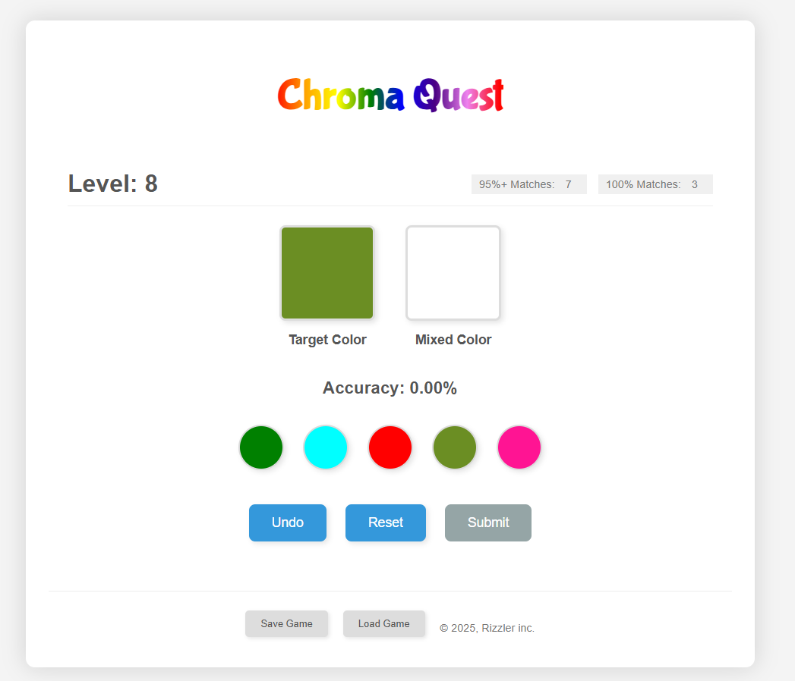

# Chroma Quest

[]

Chroma Quest is a stylish and engaging HTML5 color mixing puzzle game. Your goal is to become a color master by accurately blending colors from a provided palette to match a target color. Level up, track your accuracy, and see how many perfect matches you can achieve!

## Play it Live!

[**Play Chroma Quest Online!**](https://your-live-demo-url.com) 

## Features

*   **Engaging Color Mixing Gameplay:**  Intuitively mix colors by clicking on the color buttons to match the target hue.
*   **Instructions Page:**  New to color mixing? The game includes a clear instructions page to get you started.
*   **Level Progression:**  Advance through increasingly challenging levels, each with a new target color to master.
*   **Accuracy Feedback:**  Real-time accuracy percentage displayed, letting you know how close you are to perfection.
*   **Accuracy Counters:** Track your progress with counters for 95%+ accuracy matches and elusive 100% perfect matches.
*   **Save and Load Game:**  Save your progress and continue your Chroma Quest journey later. Save files are encrypted for basic protection.
*   **Seeded Levels:**  Levels are generated using a seed, ensuring the same color challenges for everyone at each level, every time.
*   **Undo & Reset Controls:** Strategically refine your mixture with the "Undo" button or start fresh with "Reset".
*   **Modern & Stylish Design:**  Clean and responsive HTML/CSS design for a visually appealing and enjoyable experience.
*   **Rainbow Title Animation:**  A visually appealing and smoothly looping rainbow animation for the game title.
*   **Cookie-Based Progress Saving:** Level and accuracy counters are saved using cookies, allowing for persistent gameplay across sessions.

## How to Play

1.  **Start Game:** Click the "Start Game" button on the Instructions page to begin your Chroma Quest.
2.  **Target Color:** Observe the "Target Color" displayed on the left. This is the color you need to create.
3.  **Mixing Palette:** Choose colors from the palette of color buttons below. Click a button to add that color to your "Mixed Color".
4.  **Mixed Color & Accuracy:** Watch the "Mixed Color" box update as you add colors. The "Accuracy" percentage shows how close your mixed color is to the Target Color.
5.  **Undo & Reset:**
    *   **Undo:** Click "Undo" to remove the last color you added to your mixture.
    *   **Reset:** Click "Reset" to clear your current mixture and start mixing for the current level again.
6.  **Submit:** Once your Accuracy is 85% or higher, the "Submit" button will be enabled. Click "Submit" to advance to the next level.
7.  **Perfect Matches:** Aim for 100% accuracy to achieve "PERFECT!" matches and increase your "100% Matches" counter!
8.  **Level Up:** Continue submitting accurate mixes to progress through the levels and become a Chroma Quest master!

## Technologies Used

*   **HTML5:**  For structuring the game and its UI.
*   **CSS3:**  For styling and modern visual design, including the rainbow animation.
*   **JavaScript:** For game logic, color calculations, user interactions, save/load functionality, and seeded randomness.

## Installation & Usage

No installation is required to play Chroma Quest! Simply:

1.  **Download or clone** this repository to your local machine.
2.  **Open `index.html`** in your web browser (Chrome, Firefox, Safari, etc.).

## Saving and Loading Your Game

*   **Save Game:** Click the "Save Game" button in the footer. This will download a file named `save.chromaquestsave` containing your encrypted game progress.
*   **Load Game:** Click the "Load Game" button in the footer.  Select your `save.chromaquestsave` file when prompted to load your saved progress.

## Customization

Feel free to customize the game's appearance by modifying the `styles.css` file.  Experiment with different color schemes, fonts, and layouts to personalize your Chroma Quest experience!

## Credits

Created by me with a little help from AI

---

Enjoy playing Chroma Quest!
